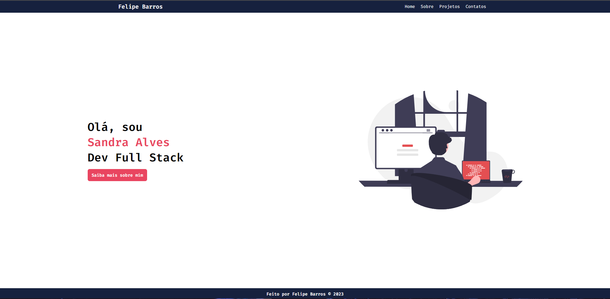
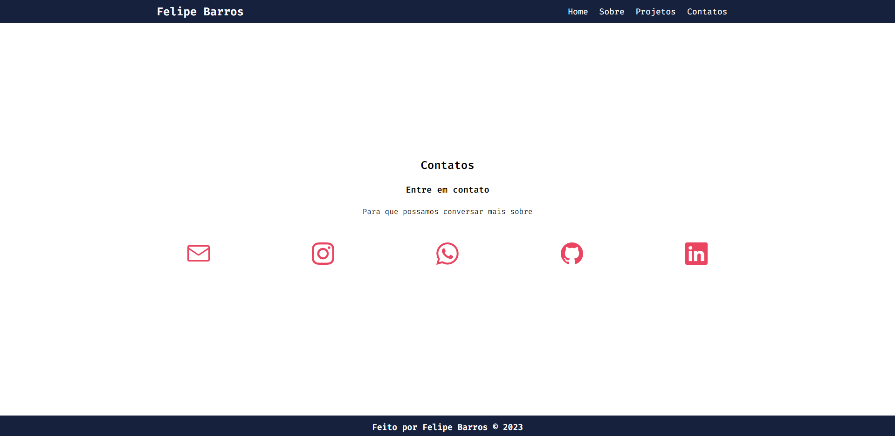

<h1 align="center"> Portfólio React </h1>

Um portfólio feito durante as aulas de Framework com intuito de utilizar e aprender mais sobre as tecnologias React e Vite
  

  <a href="#-tecnologias">Tecnologias</a>&nbsp;&nbsp;&nbsp;|&nbsp;&nbsp;&nbsp;
  <a href="#-preview">Preview</a>&nbsp;&nbsp;&nbsp;|&nbsp;&nbsp;&nbsp;
  <a href="#-projeto">Projeto</a>&nbsp;&nbsp;&nbsp;|&nbsp;&nbsp;&nbsp;
  <a href="#-layout">Layout</a>&nbsp;&nbsp;&nbsp;|&nbsp;&nbsp;&nbsp;
  <a href="#memo-licença">Licença</a>

---

 

## 🚀 Tecnologias

Esse projeto foi desenvolvido com as seguintes tecnologias:

- HTML e CSS
- JavaScript
- React e Vite
- Git e Github
- Figma

## 🚩 Preview 

<h3 align="center"> Layout Web 💻 </h3>

 

  

##

 

  

## 📁 Projeto

- [Acesse o projeto finalizado, online](https://nkdwon.github.io/PortfolioReact/)

## 🔖 Layout

Você pode visualizar o layout original do projeto através [DESSE LINK](https://www.figma.com/community/file/1253907573035661296/portfolio_SANDRA). É necessário ter conta no [Figma](https://figma.com) para acessá-lo.

## :memo: Licença

Esse projeto está sob a licença MIT.

---